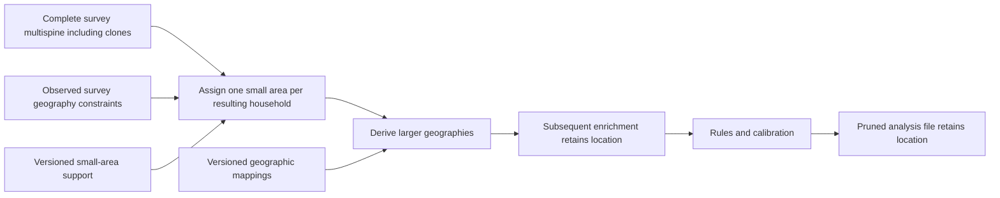

# Geography assignment in the population graph

Design decision, corrected 10 September 2026: finish constructing the full survey
multispine, including its initial support and PUF clones, then assign one small
census area to each resulting household. Derive larger geographies from that
area using identified, versioned mappings. Distinct clones may receive different
areas subject to their observed source constraints. The assigned location then
remains fixed through subsequent enrichment, calibration and analysis views.

The earlier block-before-clone implementation and its passing controls remain
historical evidence. They do not demonstrate this corrected ordering. Geographic
assignment must use a stable post-clone identity, including a clone discriminator
where original-source identity alone is shared by multiple households.

The corrected order now passes 70 controls on invented inputs, plus a separate
default-path compatibility check. The nine-node survey prefix expands the initial
clones before assignment; its nineteen-node financial and twelve-node age
extensions retain the assigned geography. Draw identity combines
`survey_geography_origin_key` with `household_support_clone_index`, so renumbering
households does not redraw their location. A typed validation artifact orders
financial enrichment after the geography gate. See the
[scoped acceptance](../experiments/us-postclone-geography-70-controls-20260910.json).
Native execution of this corrected order and population-quality acceptance
remain pending. The older results below retain their original source scope.

## Declarative country capability

Geography is a declarative country capability backed by shared graph operators.
A country declares its atomic area type, code system and vintage, source mapping
artifacts, observed-geography constraints and sampling-weight convention. The UK
declaration can select an area system by nation. Adding a country should not
require writing a country-specific assignment or derivation kernel.

The shared assignment operator selects the atomic area using the declared
support and stable household identity. Shared lookup/join operations derive
larger geographies from identified mappings. If an input already has a qualified
atomic area, validate and retain it. Source acquisition and normalization may
still require publisher-specific adapters; they produce the common support and
mapping contracts, rather than owning a separate assignment algorithm.

Sampling and derivation remain executable graph operations with typed inputs,
outputs and replay identity. A country configuration does not itself execute
them. Mapping edges retain their relation type, including exact nesting or an
explicit best-fit convention. Prefer existing graph lookup/join primitives where
they support these contracts; introduce only the shared behavior they lack.

The existing country-spec geography declaration is a starting point, but its
legacy clone-and-assign contract and country-specific runtime references do not
yet implement this shared atomic-area contract. Preserve those compatibility
paths while the shared operators and country adapters receive their own checks.

## Country anchors

| Country | Assigned household anchor | Derived geographies |
| --- | --- | --- |
| US | Census block, with census vintage | Block group, tract, county, state, PUMA and congressional district using the declared mapping/boundary vintages |
| England and Wales | 2021 Output Area | LSOA, MSOA, local authority, ward, constituency and region |
| Scotland | 2022 Output Area | Scottish statistical areas, council area, ward, constituency and region |
| Northern Ireland | 2021 Data Zone | Super Data Zone, local government district, constituency and nation |

Northern Ireland's 2021 Data Zones replaced the 2011 Small Areas. Scottish
Output Areas use the 2022 census. These are different source systems; the graph
must retain the original area type and vintage rather than imply identical units.
See [NISRA census output geography](https://www.nisra.gov.uk/statistics/census-2021-results/census-output-geography)
and [Scotland's census general report](https://www.scotlandscensus.gov.uk/about/scotlands-census-2022-general-report/).

Some larger boundaries do not nest exactly. England and Wales small-area estimates
use best-fit mappings for wards and parliamentary constituencies. The derived
edge must identify whether its mapping is exact, best-fit or another explicit
approximation, with its source and vintage. A mapping convention cannot be
presented as observed household location. See the
[ONS methodology](https://www.ons.gov.uk/peoplepopulationandcommunity/populationandmigration/populationestimates/methodologies/smallareapopulationestimatesqmi).

For US congressional districts, the Census Bureau's CD119 block equivalency
file assigns whole original 2020 tabulation blocks to districts. Colorado's
block `080010096072000` crosses the enacted CD07/CD08 boundary but is assigned
to CD08 for tabulation. Represent this as an official tabulation mapping,
not exact spatial containment. The same source distinguishes original 2020
blocks from subsequently adjusted geometry and includes undefined `ZZ` areas.
See the [Census Bureau's CD119 documentation](https://www.census.gov/geographies/mapping-files/2025/dec/rdo/119-congressional-district-bef.html).
By contrast, the same-vintage tract-to-PUMA relation is nested, as described in
the [Census PUMA guidance](https://www.census.gov/programs-surveys/geography/guidance/geo-areas/pumas.html).

## Required behavior

- Respect observed source constraints, such as ACS PUMA and FRS region. Record
  inferred geographic detail as modeled. Preserve observed source geography
  separately from the assigned location.
- Bind each draw to a stable household identity, seed and assignment definition.
  Reordering rows or selecting an existing household must not redraw its location.
  Changed source support or boundary mappings produce a new identified revision.
- Assign household members consistently with their resulting household. Initial
  clones have distinct draw identities and may receive different anchors.
  Materialized county, district and other fields must agree with that household's
  selected anchor. Source geography remains a separate observed constraint.
- Show assignment and derivation as separate operations in the graph. Expose the
  source constraints, support, sampling weights, mapping conventions and judgment
  annotations in the inspector.
- Refuse missing, ambiguous or incompatible mappings unless an explicit,
  source-supported resolution rule is part of the assignment definition.
- Verify inheritance and mapping consistency again on every pruned export.
  Engine input profiles and geographic build invariants are separate contracts.

## Existing implementation and next changes

The shared implementation now lives in `microcosm.build.atomic_geography` and
`microcosm.build.graph_atomic_geography`. It provides four country-neutral nodes:
`geography.support_import@1`, `geography.assign_atomic@1`,
`geography.derive@1` and `geography.gate@1`. Countries supply declarations and
normalized, pinned support files. The graph interfaces and legacy country
operators are unchanged. Country configuration and native support integration
remain necessary before these nodes can assign locations in a release build.

The support contract uses deterministic NPZ bytes with no object arrays. It has
one unique string code per atomic area; every mapping column identifies its
source, vintage and relation, and every integer sampling-weight column identifies
its source and basis. Nonnegative weights have a bounded exact total. A source
adapter must resolve any nonfunctional crosswalk before admission; the shared
lookup never multiplies households through a many-to-many join.

Assignment conditions on all nonmissing observed constraints jointly. Declared
stages can use different weights—for example, household counts to select a
constituency followed by population counts to select its small area. Each draw
uses the existing `keyed_uniform` protocol with stable source identity, the
declared stream, system, stage, assignment definition and support digest.
Selection uses an integer inverse CDF. Reordering, subsetting or adding unrelated
households preserves draws. The numerical declaration remains `platform_bitwise`;
cross-platform equivalence has not been established.

The version-1 declaration lists `identity`, `stream`, three assignment `outputs`
(`area`, `system`, `basis`), and `systems`. Each system supplies its atomic
identity and source, a selector, observed constraints, an optional observed-area
column, sampling stages and derived layers. Geographic codes use nullable
strings throughout, retaining leading zeroes. An engine that needs integer
storage must declare that conversion separately. A system without a particular
layer produces missing values for that layer, which the integrity gate checks.
The graph stores the canonical declaration in its normative `definition`
parameter and exposes the stream separately; no graph parameter grammar changed.

The 34 invented-data controls include real graph execution, cold and warm reuse,
source-change invalidation, exact lookup metadata, independent sampling-boundary
checks, three-system routing, observed-area retention, row/subset stability and
clone/prune validation. All passed under the isolated control runner on
9 September 2026. These checks establish shared operator behavior; they do not
admit a Census/ONS source or certify any population's geographic fit. The gate
checks mapping integrity, while the executor and build own structural lineage
and population-quality acceptance. The country's chosen identity still needs
verification across actual sampling rungs.

The US development composed graph attaches geography after harmonization, but
`us_runtime/graph_geography.py` selects a joint tract/congressional-district cell
and emits PUMA, county and district. It does not assign a Census block. Its prior
national source and joint-support checks therefore do not establish block-first
acceptance. The separate atomic survey graph now provides that block assignment
and derivation connection before enrichment. Its population-only national block
support and source review are recorded below.

The UK already has an area-based ladder in `uk_runtime/geography_ladder.py`.
Its sampler selects a constituency within FRS region using household counts,
then an OA within constituency using population; one selected ladder row supplies
the other geographies. It currently consumes a shared seeded random stream, so
stable household-keyed assignment under reordering and subsets still needs work.
The graph should expose the final OA/Data Zone assignment and the mapping
derivations explicitly, including that sampling convention.

The Northern Ireland source builder currently infers Data Zone constituencies
using the modal active-postcode constituency. Review the official
[NISRA constituency aggregation and lookup resources](https://www.nisra.gov.uk/publications/census-2021-output-geography-information-papers)
before choosing or replacing that approximation. Source existence is not
acceptance of a particular lookup or its application to the population.

The US block adapter in `us_runtime/atomic_block_support.py` now preserves each
supplied block, leading zeroes, population weight and the source-labeled
tract-to-PUMA and block-to-district mappings. Its declaration uses the shared
operators, preserves observed state/PUMA separately, and labels CD119 as
`official_tabulation`. Its sampling proxy is 2020 persons; this does not imply
household counts or support for subsequent construction in unpopulated 2020
blocks. All 13 invented tests passed, including missing/inconsistent mapping
refusals and subset-stable assignment. Receipt SHA256:
`404deb7666b3ac9b8a654181228c545ab95c131f30a1fbe65a2e15d5a08a4c4c`.
These initial adapter tests do not establish native geographic fit. Subsequent
national support and native pilot results are recorded below.

The earlier `us_runtime/graph_atomic_survey_clone.py` declared this sequence:
shared import, assignment, derivation and integrity gate, then the existing
combined-survey support clone and an inherited-mapping gate. The graph compiler
makes the clone depend on every member of its base version, including the
pre-clone gate. The post-clone gate never draws another location. An actual
executor control passes cold execution and required replay: four invented
households become eight, every location column is inherited, all entity rows
are copied, and each household weight is split equally across the pair.
Subset mapping verification also passes. Receipt SHA256:
`1bb75a5ee53edcbdd199a6d0163cbe75c32e54c80513cb3eb8d13021c3c2b1c3`.
A separate source-only Codex review found no actionable defects.

The current survey path now qualifies observed state and ACS PUMA from the
retained original-source preparation. Eleven source controls and fourteen graph
controls passed, covering missing geography, source changes, replay and stable
household identity across sampling rungs. These controls use invented originals
through the actual source issuers. Their receipts are recorded in
`experiments/us-survey-geography-source-controls-20260909.json` and
`experiments/us-survey-geography-graph-controls-20260909.json`.

The earlier `us_runtime/graph_atomic_survey_population.py` connected that projection
to block assignment, geographic derivation, the integrity gate and the combined
survey clone. It retains the raw allocation separately from the enriched
pre-clone population, even though both share the allocation version identifier.
The complete ten-node prefix passed five controls: fresh execution, required
replay, full geography inheritance, support-byte mismatch and late mutation
refusals. The test population contains six survey households before cloning and
twelve afterward. The exact tested revisions and remaining checks are recorded
in `experiments/us-atomic-survey-population-controls-20260909.json`.

The earlier calibration budget and age runner consumed this optional prefix
and independently reconstructed it from the raw allocation. Eight budget
controls passed, as did the complete thirteen-node age graph through fresh
execution and required replay. A separate compatibility control verifies that
the existing predictor and PUF-host qualifiers still accept the default survey
prefix. See the corresponding `us-atomic-budget-semantic-8`,
`us-atomic-age-v2-1`, and `us-budget-predictor-compatibility-1` records in
`experiments/`.

Replay can canonicalize the hidden backing values of missing numeric cells.
Persistent budget identities therefore bind logical Frame values, population
version, complete ownership, weight kinds, mass ledger and exact design-weight
bytes. They exclude only the helper receipt's physical population stamp.
Same-object mutation checks retain physical identity. The initial physical-stamp
replay failure remains recorded; the corrected budget controls pass.

The byte-source adapter passed thirty-six invented-source controls through the
maintained PL, CD and PUMA parsers. This does not authorize acquisition of native
PL archives, which also contain housing segments. Native support preparation
will instead request only Census `P1_001N` block populations and independent
state totals, then join CD119 and tract-to-PUMA mappings. Delaware is the first
source control; national survey assignment requires complete admitted support
for the fifty states and DC. No native acquisition is accepted by these tests.

`us_runtime/atomic_block_api_sources.py` implements that population-only response
adapter. All thirty-five invented controls pass, including independent state
totals, exact block preservation, missing mappings, malformed response fields,
byte limits and late source-record mutation. Request descriptors preserve the
repeated Census `in` parameters and omit credentials. The adapter does not infer
the response's origin from its contents; acquisition and publisher qualification
remain separate. Evidence:
`experiments/us-atomic-block-api-sources-35-controls-20260909.json`.

Publisher-qualified native block support, national and district calibration,
and pruned export verification remain necessary for a release. Source integrity
checks and successful invented-data runs do not establish geographic fit.
