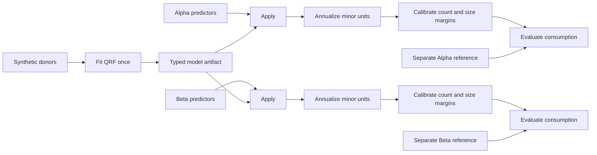

# One fitted model, two synthetic destinations

Run the complete example from an installed Microcosm constellation with the
typed-artifact graph extension:

```bash
python -m microcosm.build.transfer_example --output /tmp/microcosm-transfer-example
```

In a development checkout, prefix the command with `uv run`. No country engine,
download, credentials, or restricted microdata is needed. The command requires
an explicit output directory and writes the following there:

- `report.json`: identities, calibration diagnostics, and held-out comparisons.
- `run_manifest.json`: execution receipts and verified store references.
- `graph.json`: the complete graph declaration.
- `store/`: source frames, fitted model, intermediate columns, and cache records.

Running again with the same output directory reuses verified results. Pickled
QRF models follow the graph's trusted-local-store convention: a digest verifies
bytes, not the safety of executing an externally supplied pickle. This example
generates and fits its own model and accepts no external model files.

## What actually runs

The example uses the real split QRF training/application kernels and the
`calibrate.adam@1` solver. The donor and both destinations are independent graph
populations. The fitted model is a typed artifact edge crossing those population
boundaries; it is not refitted separately for each destination.



All data are generated engineering fixtures. There are 64 donor households and
24 recipient households per fictional destination. Household size and a binary
dwelling category predict synthetic monthly consumption. Donors carry unequal
design weights; recipient sources contain no consumption outcomes. Each source
has one linked synthetic person per household to meet Frame's structural
contract. That person is a linkage placeholder: estimates use household weights,
and the number of person rows is not an estimate of population size.

The conversion records the floating-point factor `12 / 100`: twelve monthly
periods and one hundred minor units per base unit. Its input convention is
explicitly **monthly synthetic minor units**. The destination `MonetaryBasis`
declares annual 2024 flows in synthetic `XXX` base currency, with a fictional
household-consumption perimeter. This is an explicit unit conversion, not a
currency exchange-rate assumption. The conversion test checks byte equality
with `raw * recorded_factor`; it does not claim exact rational arithmetic.

Alpha starts at design mass 1,200 households and targets an average household
size of 2.9; Beta starts at 800 and targets 2.1. Calibration uses only household
count and summed household size. The solver, REWEIGHT node, and weight transition
all explicitly declare `mass="free"`. The report records actual initial and
final household mass, residuals, effective sample size, and maximum weight share.
Consumption does not enter the target matrix. The existing calibrator reports
that it does not consume target standard errors; none are supplied here.

## Separate evidence, separate verdicts

Each held-out reference is independently generated from the fixture's declared
process, with 96 households and disjoint identifiers. Monthly reference
consumption is `8000 + 5000 * household_size + 1000 * dwelling`; reference design
weights have a specified size tilt. Donors also carry residual variation. The
reference generator never reads fitted models, recipient predictions, or solver
results. Reference sources are declared only on evaluation nodes.

The report separates `calibration_passed` from `heldout_passed`. Its 2% margin
tolerance and 15% consumption tolerance are engineering fixture expectations,
not reviewed scientific thresholds. Held-out checks compare the consumption
mean and consumption means by household size. The tests deliberately multiply
one reference's consumption by ten: its held-out verdict fails while marginal
calibration remains successful. The fitted model, application outputs, and
calibrated weights remain unchanged.

Every report declares `scope="synthetic_engineering"`. Neither a successful run
nor a passing fixture check certifies a country population, an empirical
transfer method, a monetary target profile, or any tax-benefit result. There is
no rules-engine evaluation or national-release promotion in this example.

## Exercising reuse from Python

```python
from dataclasses import replace
from microcosm.build.transfer_example import (
    default_targets,
    make_synthetic_inputs,
    run_transfer_example,
)

inputs = make_synthetic_inputs()
first = run_transfer_example("/tmp/microcosm-transfer-example", inputs=inputs)
targets = default_targets()
targets["alpha"] = replace(targets["alpha"], size_total=3600.0)
second = run_transfer_example(
    "/tmp/microcosm-transfer-example", inputs=inputs, targets=targets
)
assert second.manifest.node("donor.fit").hit
assert second.manifest.node("alpha.apply").hit
assert not second.manifest.node("alpha.calibrate").hit
assert second.manifest.node("beta.calibrate").hit
```

`test_transfer_graph_example.py` also checks real fitting occurs once across
both destinations and warm runs; recipient edits affect their branch only;
donor values or weights invalidate both applications; mismatched destination
bases refuse; and held-out changes affect evaluation alone. The test lives in
the flat build test inventory and is explicitly assigned to shared/spec CI.
