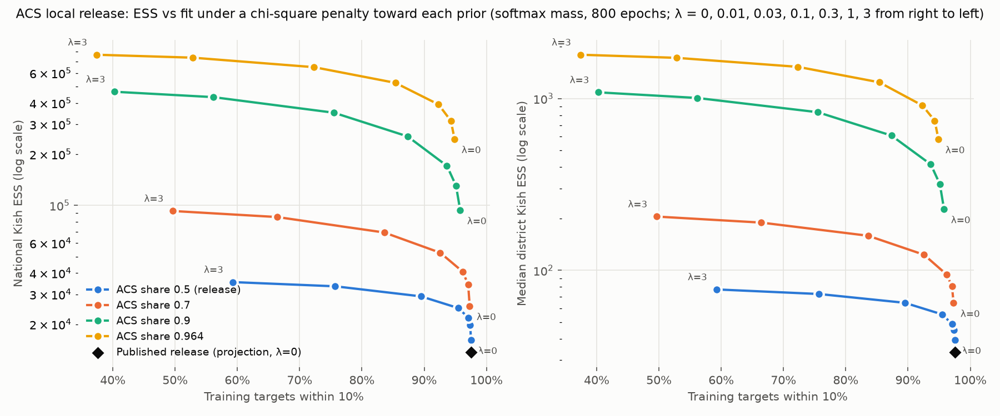

# ACS local release: effective sample size versus fit under a design-weight penalty

Full-scale evidence for the chi-square L2 basis (`l2_basis="chi_square"`) and
the softmax mass parametrization added in this branch; the algebra and the
small-problem evidence are in [docs/calibration-l2-basis.md](../../docs/calibration-l2-basis.md).
Everything here recalibrates the published ACS local release,
`populace-us-2024-buildo-acs-local-767312d60-20260923T074941Z` (1,588,854
households, 4,459 targets), from its own calibration checkpoint, on Modal. It is
research evidence: nothing was published, and no default changed.

Two losses are covered. The sections through "Recommendation" use the loss
the release calibrated on, every target weighted equally. "On the weighted
loss" reruns the frontier with the national release's target weighting
(microcosm#1104) and re-picks λ there; that re-pick supersedes the λ in
"Recommendation".

## The question

On 2026-09-28 David Trimmer measured the release's weights in #microcosm:
national Kish ESS of about 14k of 1.59M, Massachusetts 477 with half its weight
on 152 records (over 36,491 Massachusetts records in the files he read), and
district ESS of 41-64. On this checkpoint's 36,578 Massachusetts households the
published weights give 446 with 149 records holding half, and the reproduction
below gives 448; the published national figure is 13,631 and the reproduction's
13,646 (`results/published_weights.json`; the record counts were not
reconciled with his). Threshold statistics (a 1.9 pp drop
in Massachusetts child poverty) rested on a few dozen households. He asked
whether to anchor calibration to the design weights. This experiment measures
what that anchor buys, what it costs, and what limits it.

## Findings

1. **Most of the concentration is in the starting weights, not the solve.**
   - The staging's `--acs-share 0.5` gives the 57,240 donor (ASEC-by-PUF) rows half the mass.
   - Those rows are the national release's records at half weight, with a within-spine ESS of 9,174.
   - So the design weights start at a national ESS of 36,288, a Massachusetts ESS of 1,020 and a median district ESS of 80, before any calibration.
   - The 1,531,614 ACS rows alone have an ESS of 812,434.
   - Calibration then moves the donor share of mass from 50% to 68% and cuts ESS to 13,646.
   - Receipts: `results/seeding_options.{json,md}`, and the national and per-spine blocks of every run.
2. **The anchor works, and at the current seeding it costs no measurable out-of-sample fit.**
   - The chi-square penalty pulls toward the design weights themselves. The old record-weighted L2 penalty pulls toward their square: at λ = 0.1 it *lowers* ESS to 8,689.
   - With the chi-square basis, ESS rises smoothly with λ.
   - On held-out targets, projection at λ = 0.03 is ahead of the release on both measures and both folds (see the table): 3.6-3.8% lower capped error and 0.9-1.2 points more targets within 10%. Each fold has its own solves for both configurations, and all four comparisons agree in sign. But held-out run-to-run variation was not measured, and λ was picked on those two folds, so treat the gain as optimistic.
3. **The seeding sets the limit.** As λ grows the solve returns to the starting weights. On every tested path the national ESS stays below the prior's (at share 0.5, λ = 3 reaches 35,386 against the prior's 36,288), though the penalty is a distance, not an ESS bound, and single districts can exceed their prior's ESS (at λ = 1 some do).
   - A larger ACS share raises that limit several-fold. At share 0.9 without a penalty: ESS 93,524, Massachusetts 2,704, no district below 50, and 95.8% of targets within 10%.
   - It also worsens held-out fit, mainly on SOI targets (held-out SOI within 10% falls from 64% to 54% at share 0.9), while held-out district populations improve.
   - That is consistent with how the staging builds the rows: the ACS rows' tax variables are transferred from the donor rows by QRF (the tool's `donor_sparse_selection_training_set` limitation), so the donor rows carry tax detail the ACS rows only approximate.
4. **The softmax parametrization is not needed at this scale for λ ≤ 0.03, and its cap loop runs out of rounds here.**
   - The per-record gradients here are near Adam's `eps`, with mixed signs (`results/gradient_scale.json`). The same-sign stall that the small-problem evidence shows does not occur.
   - The two parametrizations trace the same training frontier for λ ≤ 0.03. At λ = 0 softmax reaches 18% more ESS (16,132 against 13,646) at a 3% higher loss (0.0160 against 0.0155), a loss gap about the size of the unpenalized solve's run-to-run variation (2.7%; see "How it was run"). At λ ≥ 0.1 projection falls inside softmax's training frontier. At λ = 0.1 projection reaches ESS 22,739 at loss 0.0228, where softmax's path (interpolated between its λ = 0.03 and 0.1 solves) gives about 0.021. At λ = 1 projection reaches 30,582 at 0.0785, against about 0.055 on softmax's path (between λ = 0.3 and 1). Equal λ is not an equal-ESS comparison.
   - Softmax's per-step cap loop runs out of its 32 rounds on most epochs at this scale: in the runs that record it (heads 9ef71ed6, bc763cb4 and d82ff85b), 165-400 of the last batch's 400 epochs, including 400 at share 0.5, λ = 0.03 on the full surface (the `dup_` rerun) and on fold 0, and every share-0.9 run. Those epochs optimize total·softmax(log_w) past the 5x cap, by an amount that is not recorded; only the closing projection makes the returned weights exact. The returned loss is within 0.3% of the last trajectory loss in every softmax run that records the count, but projection runs, which have no cap loop, show the same gap (0.01-0.33%), so it says nothing about the overshoot. Projection is the recommended parametrization.

## Key configurations

"Held-out error" is the mean capped scaled error, and "held-out within 10%"
the share of targets within 10%, on a rotated 20% of targets
(`microcosm.build.holdout.rotated_folds(4459, n_folds=5, seed=20260529)`)
never seen by that solve. MA is Massachusetts. Each configuration's training fit
and concentration come from its full-surface run; "–" marks a fold not run.

<!-- key-configs:start (written by analyze.py) -->
| Configuration | National ESS | Top-1% share | State ESS min | CD ESS median / min | CDs < 50 | MA ESS | Train within 10% | Held-out error, fold 0 / 1 | Held-out within 10%, fold 0 / 1 |
|---|---:|---:|---:|---:|---:|---:|---:|---:|---:|
| Release (reproduced): share 0.5, projection, λ 0 | 13,646 | 69.3% | 195 | 33 / 12 | 352 | 448 | 97.6% | 0.1296 / 0.1236 | 63.3% / 65.8% |
| Share 0.5, projection, chi-square λ 0.03 | 20,690 | 63.7% | 204 | 46 / 22 | 278 | 589 | 97.3% | 0.1247 / 0.1191 | 64.2% / 67.0% |
| Share 0.5, softmax, chi-square λ 0.03 | 21,835 | 61.6% | 213 | 49 / 23 | 239 | 620 | 97.1% | 0.1242 / 0.1166 | 63.1% / 66.3% |
| Share 0.5, projection, chi-square λ 0.1 | 22,739 | 62.0% | 207 | 51 / 27 | 208 | 616 | 95.9% | 0.1285 / – | 61.7% / – |
| Share 0.5, softmax, chi-square λ 0.1 | 24,895 | 59.2% | 222 | 55 / 29 | 132 | 664 | 95.5% | 0.1263 / 0.1210 | 61.5% / 63.8% |
| Share 0.5, softmax, chi-square λ 1 | 33,418 | 53.3% | 269 | 73 / 47 | 4 | 907 | 75.7% | 0.1505 / – | 50.1% / – |
| Share 0.7, softmax, chi-square λ 0.01 | 34,280 | 46.9% | 319 | 81 / 24 | 30 | 992 | 97.1% | 0.1466 / 0.1416 | 60.4% / 60.5% |
| Share 0.9, softmax, no penalty | 93,524 | 27.8% | 599 | 227 / 64 | 0 | 2,704 | 95.8% | 0.1765 / 0.1767 | 56.1% / 56.7% |
| Share 0.9, softmax, chi-square λ 0.01 | 130,608 | 24.2% | 612 | 317 / 85 | 0 | 3,285 | 95.1% | 0.1785 / – | 54.9% / – |
| Share 0.964, softmax, no penalty | 244,979 | 17.9% | 594 | 578 / 265 | 0 | 6,591 | 94.9% | 0.1952 / 0.1984 | 51.6% / 52.4% |
<!-- key-configs:end -->

The full grid, the per-family fit, the holdout detail and candidate floors are
in `results/frontier.md`, `results/floors.md` and `results/frontier.csv`:

## Recommendation

Two decisions, kept separate because they trade different things.

**1. Calibration: adopt the chi-square penalty at the current seeding.**
On today's loss, use `--l2-basis chi_square --l2-lambda 0.03` with the
default `--mass-parametrization projection`.
- Against the release it improves every concentration measure:
  - national ESS from 13,646 to 20,690;
  - Massachusetts from 448 to 589;
  - districts below ESS 50 from 352 to 278;
  - the smallest district from 12 to 22.
- Out of sample it is ahead on both measures and both folds: held-out error 0.1247 and 0.1191 against 0.1296 and 0.1236, and held-out within 10% 64.2% and 67.0% against 63.3% and 65.8%. Held-out run-to-run variation was not measured and λ was picked on these folds, so treat that as "no worse, probably slightly better".
- In sample it costs a little: training loss rises from 0.0155 to 0.0181, and training targets within 10% fall from 97.6% to 97.3%.
- Softmax at λ = 0.03 gives a little more ESS (21,835). Against projection, its held-out fit is a toss-up (lower capped error, fewer targets within 10%, both by small margins). What separates them is training fit (loss 0.0192 against 0.0181, 6% higher, against 0.3% run-to-run variation at this λ) and softmax's cap loop (finding 4). Projection is the default and the better-supported choice.
- λ = 0.1 (softmax) buys more ESS (24,895; 132 districts below 50) and lower held-out error than the release, but lower held-out within 10% on both folds (61.5% and 63.8%), and 2 pp of training fit.
- **λ is in units of the loss.** The release weighted every target equally (`calibrate` got no `target_loss_weights`), and IRS SOI cells are 3,819 of the 4,459 targets. microcosm#1104 weights them as the national release does; "On the weighted loss" below re-picks λ on that loss and supersedes this recommendation's λ.

**2. Construction: the ACS share of the mass is the bigger lever, and it costs out-of-sample fit.**

| ACS share | National ESS | MA ESS | Districts below 50 | Held-out error, fold 0 / 1 |
|---|---:|---:|---:|---:|
| 0.5, no penalty (release reproduced, projection) | 13,646 | 448 | 352 | 0.1296 / 0.1236 |
| 0.7, λ 0.01 (softmax) | 34,280 | 992 | 30 | 0.1466 / 0.1416 |
| 0.9, no penalty (softmax) | 93,524 | 2,704 | 0 | 0.1765 / 0.1767 |

The share-0.7 and share-0.9 rows are softmax solves (at share 0.5, softmax
alone gave 18% more ESS than projection at λ = 0); a projection solve at those
shares was not run.

That is a methodology call: more stable local estimates against worse
aggregate SOI fit. It also overlaps the support-mix bake-off (#1067, decision
d701), which recommends ACS rows plus CPS, seeded in proportion to their
counts, for the local file.

**ESS floor as a release gate.** At the current seeding, no tested
configuration gets every district to ESS 50: even λ = 1 (76% within 10%)
leaves 4 districts below it, and λ = 3 leaves 1. So the gate should catch
calibration-induced collapse now and rise with the seeding. Across each
configuration's three solves (full surface, fold 0, fold 1):

| Configuration | Districts below 25% of their starting ESS | Smallest district ESS | Smallest state ESS |
|---|---|---|---|
| Release reproduced (projection, λ 0) | 15 / 22 / 24 | 11.7 / 10.7 / 7.8 | 195 / 203 / 177 |
| Softmax, λ 0 | 8 / 5 / – | 13.1 / 14.8 / – | 201 / 210 / – |
| Projection, λ 0.03 | 0 / 0 / 0 | 22.4 / 22.9 / 24.2 | 204 / 205 / 193 |
| Softmax, λ 0.03 | 0 / 0 / 0 | 23.0 / 23.0 / 24.1 | 213 / 216 / 203 |

- **The gate to adopt now:** no district below a quarter of its starting ESS.
  It separates cleanly at share 0.5: every penalized solve there has 0, and
  the release has 15-24. It measures collapse relative to the seeding, so it
  binds harder as the seeding improves: at share 0.9 the unpenalized solves
  leave 261-328 districts below a quarter of their (much higher) starting ESS,
  λ = 0.01 leaves 72-121, λ = 0.03 leaves 33, and λ = 0.1 leaves 0. A
  share-0.9 release would pass it only with a penalty around 0.1.
- **An absolute district floor of 15:** it also separates (release at most 11.7, λ = 0.03 at least 22.4), with some margin.
- **No state floor:** a state floor near 200 sits inside the solves' spread (177-216), so it would flap.
- **With an ACS share of 0.9 or more:** raise the floors to every district at least 50 and every state at least 500. Across every solve at shares 0.9 and 0.964 (full surface and folds, every λ), the smallest district is at least 63.7 and the smallest state at least 549, so the state floor's margin is about 10%. At share 0.964 the relative gate leaves 13-30 districts unpenalized and 0 from λ = 0.01.

Main's tool already records ESS by state and district in the calibration
summary, so the gate is a finalize-stage check on data it already has.

## On the weighted loss

The equal-weight frontier above calibrates with every target counting once,
so the 3,819 IRS SOI cells carry 85.6% of the loss. microcosm#1104 weights
the ACS local build's targets like the national release, through one shared
implementation (`microcosm.build.us_runtime.target_loss_weights.
us_acs_local_target_loss_weights`, row mapping `us_acs_local.v1`, formula
`sqrt_value_concept_budget_weighted_mape_50_50_amount_count_target_scale_cap_100pct`,
no family multipliers by default). This section reruns the frontier on that
loss and re-picks λ (decision d797; d792 is superseded by it).

**The weights.** `registry.py` rebuilds this checkpoint's 4,459 target specs
from the 09-23 release's own feed and settings (every name and value matches
the checkpoint exactly), and `sweep.py` hands the training specs to the
shared function. On the full surface the weights run from 0.026 to 20.1, the
effective number of targets is 1,405, and the loss vector's digest is
`ba36f887407181dc…` (the figure #1104 records for this surface). Shares of
the loss (`results/weighting_shift.md`, per target in
`results/target_loss_weights.csv`):

| Family | Targets | Equal weights | Shared weights |
|---|---:|---:|---:|
| IRS SOI (state) | 3,819 | 85.6% | 90.2% |
| State population | 51 | 1.1% | 4.4% |
| District population | 436 | 9.8% | 1.7% |
| Medicaid enrollment | 51 | 1.1% | 2.0% |
| SNAP | 102 | 2.3% | 1.7% |

District population falls because each state's district rows form one
concept group, scaled to sum to its largest member's weight: California's 52
districts carry 1.51 between them, an at-large district 1.30-1.70.

**Findings.**

1. **The release settings fit the weighted loss as they fit the old one.**
   At share 0.5, projection, λ 0, the weighted solve reaches national ESS
   13,707 (13,646 on the equal loss) and weighted loss 0.0097; the
   equal-weight release scores 0.0107 on the weighted loss.
2. **The penalty still buys ESS and held-out fit, now with an interior
   optimum.** Held-out weighted error (the objective's out-of-sample form)
   at projection λ 0, 0.03, 0.1, 0.2 and 0.3 is 0.0784, 0.0721, 0.0708,
   0.0742 and 0.0787: lowest at 0.1, 9.3% and 10.1% below the release
   settings on folds 0 and 1, while ESS rises from 13,707 to 21,751.
   Projection is ahead of softmax at every λ held out (0.0721 against 0.0736
   at 0.03, 0.0708 against 0.0740 at 0.1, 0.0784 against 0.0828 at 0).
3. **The weighted loss costs district population fit, and the penalty
   multiplies it.** On the equal loss every trained district population is
   within 0.7% at λ 0 and 0.03. On the weighted loss, 11 of 436 districts
   miss by more than 10% at λ 0 (worst TX-14 −33%, CA-29 −32%), 73 at
   λ 0.03 (worst 46%) and 135 at λ 0.1 (worst 50%). The misses sit in states
   with many districts (at λ 0.1: California 27 of 52, Texas 18 of 38,
   Florida 14 of 28, Pennsylvania 10 of 17, New York 10 of 26); state
   populations stay within 3.8%. Held-out district populations are predicted
   poorly in every configuration (held-out capped error 0.095-0.112), and they
   carry 1.7% of the held-out weighted loss, so the held-out measure does not
   see this cost.
4. **Multiplying the population family by 8 buys it back and is the best
   held-out configuration.** `--target-family-loss-multiplier
   census_population=8` (in the training weights; scoring keeps the default
   weights) returns district population to 9.5% of the loss, about its
   equal-weight share, and state population to 24.7%. At λ 0 it leaves no
   district beyond 10% and already cuts held-out weighted error by 8%
   (0.0721). At λ 0.03 it gives 0.0704, the lowest of every configuration
   held out, weighted or equal-weight (on each fold separately too), with ESS 19,874, Massachusetts 574, the smallest district 22, no district
   below a quarter of its starting ESS on any of its three solves, and 3
   districts beyond 10% (worst 15%): better district fit than the release
   settings on the weighted loss (11, worst 33%). Most of the held-out gain is
   on SOI (95% of the yardstick): its held-out capped error falls from 0.132
   to 0.119 here and at default λ 0.1 alike. Held-out district error falls
   most with the multiplier: 0.111 to 0.095, against 0.106 at default λ 0.03
   and 0.111 at λ 0.1. At λ 0.1 the multiplier
   leaves 24 districts beyond 10% and held-out error rises to 0.0724.
   ×4 sits between (λ 0.03: 8 districts beyond 10%, worst 32%).
5. **Training on the weighted loss is no better out of sample without the
   multiplier.** The equal-weight pick (projection λ 0.03, trained on the
   equal loss) scores 0.0724 on the weighted held-out yardstick, against
   0.0721 for the same settings trained on the weighted loss, and it keeps
   every district population (`results/cross_scores.json`).
6. **Share 0.9 behaves as on the equal loss.** ESS 81,714 (93,524 there),
   held-out weighted error 36-41% above the release settings, and the
   relative gate fails on every solve (318-371 districts). That remains the
   construction call in d793.

### Key configurations on the weighted loss

<!-- weighted-key-configs:start (written by analyze.py) -->
| Configuration | National ESS | CD ESS median / min | CDs < 50 | CDs < ¼ of prior | MA ESS | Weighted loss (default weights) | Train within 10% | Trained CD populations > 10% off / worst | Held-out weighted error, fold 0 / 1 | Held-out within 10%, fold 0 / 1 |
|---|---:|---:|---:|---:|---:|---:|---:|---:|---:|---:|
| Release settings: share 0.5, projection, λ 0 | 13,707 | 34 / 11 | 351 | 28 | 478 | 0.0097 | 97.2% | 11 / 33% | 0.0786 / 0.0783 | 62.3% / 63.9% |
| Share 0.5, projection, chi-square λ 0.01 | 17,758 | 40 / 16 | 320 | 0 | 546 | 0.0113 | 96.5% | 38 / 45% | – / – | – / – |
| Share 0.5, projection, chi-square λ 0.03 | 19,618 | 44 / 19 | 302 | 0 | 580 | 0.0134 | 95.5% | 73 / 46% | 0.0723 / 0.0719 | 64.0% / 65.9% |
| Share 0.5, projection, chi-square λ 0.1 | 21,751 | 49 / 28 | 240 | 0 | 609 | 0.0192 | 92.3% | 135 / 50% | 0.0713 / 0.0704 | 64.3% / 66.3% |
| Share 0.5, projection, chi-square λ 0.2 | 23,363 | 52 / 31 | 178 | 0 | 645 | 0.0268 | 89.2% | 171 / 51% | 0.0750 / 0.0735 | 63.1% / 64.6% |
| Share 0.5, projection, chi-square λ 0.3 | 24,816 | 55 / 34 | 125 | 0 | 684 | 0.0350 | 85.7% | 182 / 52% | 0.0803 / 0.0771 | 59.6% / 63.1% |
| Population ×4: share 0.5, projection, λ 0 | 14,201 | 34 / 11 | 348 | 21 | 483 | 0.0111 | 97.2% | 0 / 0% | – / – | – / – |
| Population ×4: projection, chi-square λ 0.03 | 19,711 | 44 / 20 | 301 | 0 | 576 | 0.0141 | 96.7% | 8 / 32% | – / – | – / – |
| Population ×4: projection, chi-square λ 0.1 | 21,904 | 49 / 27 | 245 | 0 | 608 | 0.0205 | 93.6% | 55 / 41% | – / – | – / – |
| Population ×8: share 0.5, projection, λ 0 | 14,114 | 34 / 12 | 348 | 18 | 472 | 0.0121 | 96.8% | 0 / 0% | 0.0719 / 0.0722 | 64.8% / 67.2% |
| Population ×8: projection, chi-square λ 0.03 | 19,874 | 44 / 22 | 301 | 0 | 574 | 0.0153 | 96.4% | 3 / 15% | 0.0706 / 0.0702 | 64.9% / 68.2% |
| Population ×8: projection, chi-square λ 0.1 | 22,146 | 49 / 27 | 233 | 0 | 609 | 0.0222 | 93.7% | 24 / 36% | 0.0734 / 0.0714 | 62.7% / 67.7% |
| Share 0.5, softmax, no penalty | 14,424 | 36 / 11 | 343 | 17 | 497 | 0.0093 | 97.2% | 13 / 35% | 0.0833 / 0.0823 | 60.1% / 63.2% |
| Share 0.5, softmax, chi-square λ 0.01 | 18,167 | 41 / 16 | 307 | 0 | 560 | 0.0113 | 96.6% | 36 / 46% | – / – | – / – |
| Share 0.5, softmax, chi-square λ 0.03 | 20,387 | 46 / 20 | 278 | 0 | 605 | 0.0139 | 95.3% | 73 / 45% | 0.0739 / 0.0732 | 62.9% / 65.7% |
| Share 0.5, softmax, chi-square λ 0.1 | 23,507 | 53 / 29 | 175 | 0 | 651 | 0.0208 | 91.7% | 136 / 46% | 0.0744 / 0.0737 | 62.8% / 65.4% |
| Share 0.5, softmax, chi-square λ 0.3 | 28,506 | 64 / 37 | 36 | 0 | 772 | 0.0408 | 83.3% | 173 / 47% | – / – | – / – |
| Share 0.5, softmax, chi-square λ 1 | 33,058 | 73 / 44 | 7 | 0 | 901 | 0.0742 | 65.5% | 182 / 45% | – / – | – / – |
| Share 0.9, softmax, no penalty | 81,714 | 198 / 64 | 0 | 371 | 2,503 | 0.0170 | 95.8% | 2 / 12% | 0.1108 / 0.1068 | 57.2% / 57.6% |
| Share 0.9, softmax, chi-square λ 0.01 | 112,432 | 270 / 75 | 0 | 220 | 3,054 | 0.0199 | 95.2% | 7 / 16% | – / – | – / – |
<!-- weighted-key-configs:end -->

### Re-picking λ

The rule, fixed before any weighted held-out result was read (commit
"Fix the weighted λ re-pick rule before the results"):

1. **Measure.** Held-out weighted capped error: each held-out target's
   capped scaled miss, weighted by its full-surface weight. It is the
   objective's own out-of-sample form, averaged over folds 0 and 1.
2. **Noise.** The two `w_dup_hold_` reruns give the run-to-run change in that
   measure on one fold. Two configurations whose fold means differ by less
   than the larger rerun change are not distinguished.
3. **Pick.** Take the configuration with the lowest mean. Then take the
   largest λ of the same parametrization whose mean is within the noise of
   it: more ESS at no measurable held-out cost.
4. **Constraints.** The pick must pass the d797 gate (no district below a
   quarter of its starting ESS) on all three of its solves (full surface and
   both folds), and its held-out unweighted share within 10% must not trail
   the release settings' by more than the noise on both folds.

<!-- weighted-lambda:start (written by analyze.py) -->
| Configuration | Loss trained on | National ESS | Held-out weighted error, fold 0 / 1 (mean) | vs release settings, fold 0 / 1 | Held-out capped error, fold 0 / 1 (mean) | Held-out within 10%, fold 0 / 1 (mean) | Trained CD populations > 10% off | CDs < ¼ of prior: full / fold 0 / 1 |
|---|---|---:|---:|---:|---:|---:|---:|---:|
| Release settings: share 0.5, projection, λ 0 | weighted | 13,707 | 0.0786 / 0.0783 (0.0784) | +0.0% / +0.0% | 0.1314 / 0.1225 (0.1270) | 62.3% / 63.9% (63.1%) | 11 | 28 / 21 / 17 |
| Share 0.5, projection, chi-square λ 0.03 | weighted | 19,618 | 0.0723 / 0.0719 (0.0721) | -8.1% / -8.2% | 0.1201 / 0.1150 (0.1175) | 64.0% / 65.9% (65.0%) | 73 | 0 / 0 / 0 |
| Share 0.5, projection, chi-square λ 0.1 | weighted | 21,751 | 0.0713 / 0.0704 (0.0708) | -9.3% / -10.1% | 0.1182 / 0.1134 (0.1158) | 64.3% / 66.3% (65.3%) | 135 | 0 / 0 / 0 |
| Share 0.5, projection, chi-square λ 0.2 | weighted | 23,363 | 0.0750 / 0.0735 (0.0742) | -4.5% / -6.1% | 0.1221 / 0.1176 (0.1198) | 63.1% / 64.6% (63.8%) | 171 | 0 / 0 / 0 |
| Share 0.5, projection, chi-square λ 0.3 | weighted | 24,816 | 0.0803 / 0.0771 (0.0787) | +2.1% / -1.5% | 0.1273 / 0.1224 (0.1248) | 59.6% / 63.1% (61.4%) | 182 | 0 / 0 / 0 |
| Population ×8: share 0.5, projection, λ 0 | weighted | 14,114 | 0.0719 / 0.0722 (0.0721) | -8.5% / -7.7% | 0.1218 / 0.1147 (0.1183) | 64.8% / 67.2% (66.0%) | 0 | 18 / 8 / 12 |
| Population ×8: projection, chi-square λ 0.03 | weighted | 19,874 | 0.0706 / 0.0702 (0.0704) | -10.2% / -10.4% | 0.1168 / 0.1119 (0.1144) | 64.9% / 68.2% (66.5%) | 3 | 0 / 0 / 0 |
| Population ×8: projection, chi-square λ 0.1 | weighted | 22,146 | 0.0734 / 0.0714 (0.0724) | -6.6% / -8.8% | 0.1207 / 0.1137 (0.1172) | 62.7% / 67.7% (65.2%) | 24 | 0 / 0 / 0 |
| Share 0.5, softmax, no penalty | weighted | 14,424 | 0.0833 / 0.0823 (0.0828) | +6.0% / +5.1% | 0.1387 / 0.1274 (0.1331) | 60.1% / 63.2% (61.7%) | 13 | 17 / 13 / 20 |
| Share 0.5, softmax, chi-square λ 0.03 | weighted | 20,387 | 0.0739 / 0.0732 (0.0736) | -6.0% / -6.4% | 0.1217 / 0.1154 (0.1186) | 62.9% / 65.7% (64.3%) | 73 | 0 / 0 / 0 |
| Share 0.5, softmax, chi-square λ 0.1 | weighted | 23,507 | 0.0744 / 0.0737 (0.0740) | -5.4% / -5.9% | 0.1216 / 0.1164 (0.1190) | 62.8% / 65.4% (64.1%) | 136 | 0 / 0 / 0 |
| Share 0.9, softmax, no penalty | weighted | 81,714 | 0.1108 / 0.1068 (0.1088) | +41.0% / +36.4% | 0.1697 / 0.1733 (0.1715) | 57.2% / 57.6% (57.4%) | 2 | 371 / 318 / 331 |
| Equal-weight release (projection, λ 0) | equal | 13,646 | 0.0779 / 0.0766 (0.0772) | -0.9% / -2.2% | 0.1296 / 0.1236 (0.1266) | 63.3% / 65.8% (64.6%) | 0 | 15 / 22 / 24 |
| Equal-weight pick (projection, λ 0.03) | equal | 20,690 | 0.0734 / 0.0715 (0.0724) | -6.7% / -8.6% | 0.1247 / 0.1191 (0.1219) | 64.2% / 67.0% (65.6%) | 0 | 0 / 0 / 0 |
| Equal-weight softmax λ 0.03 | equal | 21,835 | 0.0750 / 0.0727 (0.0738) | -4.6% / -7.1% | 0.1242 / 0.1166 (0.1204) | 63.1% / 66.3% (64.7%) | 0 | 0 / 0 / 0 |
<!-- weighted-lambda:end -->

The `w_dup_hold_` reruns moved held-out weighted error by +0.37% (release
settings) and −0.12% (softmax λ 0.03), so the noise threshold is 0.37%.

**The rule's pick: projection λ 0.1.** It has the lowest mean held-out
weighted error among the configurations on the default weights (0.0708).
λ 0.2 is 4.8% higher, beyond the noise, so step 3 stays at 0.1. It passes
both constraints: no district below a quarter of its starting ESS on any of
its three solves, and held-out within 10% of 64.3% and 66.3% against the
release settings' 62.3% and 63.9%.

**But the rule did not anticipate finding 3.** At λ 0.1 the default
weighting leaves 135 of 436 trained district populations more than 10% off,
up to 50%. For a local-area file that is disqualifying, and nothing in the
rule weighs it.

**Recommendation.** Calibrate the ACS local release with
`--l2-basis chi_square --l2-lambda 0.03` (projection, the λ d797 names) and
`--target-family-loss-multiplier census_population=8`.

- It has the lowest held-out weighted error of everything tested, 10.2% and
  10.4% below the release settings on the two folds.
- ESS 19,874 against 13,707, Massachusetts 574 against 478, the smallest
  district 22 against 11.
- It passes d797's gate on every solve, and it misfits 3 district
  populations (worst 15%) against the release settings' 11 (worst 33%).
- Its λ is d797's; the multiplier is the new call.

The multiplier was tried after the first pass showed the district cost, so it
was not chosen under the pre-registered rule. Only ×4 and ×8 were run, and
only ×8 has held-out folds; a value between, or a district-only lever, was not
tested. If the build keeps #1104's default (no multiplier), the rule's λ is
0.1, with the district cost above.

- **Inputs.** The release's calibration checkpoint was a 28.7 GB dense
  float32 frame. The sparse copy used here (`target_matrix.npz`, 4,459 ×
  1,588,854, 24,773,532 nonzeros) was checked value for value against 3,000
  sampled dense rows (`results/csr_verification.json`). Design weights and
  target values equal the release's.
- **Harness.** `sweep.py` calls `microcosm.calibrate.calibrate` with the
  tool's settings: Adam, lr 0.02, `mass="conserve"`, `max_weight_ratio=5`,
  `target_loss_cap=1`, seed 0, 800 epochs as two warm-started batches of 400.
  Each run adds its own `l2_lambda`, `l2_basis`, `mass_parametrization` and
  prior (`acs_share`).
  - The prior rescales each spine to its share of the unchanged total, keeping
    proportions within a spine. That matches `--acs-share` in the staging.
  - The prior is the frame's weights, so it is also the chi-square anchor and
    the base of the 5x cap.
- **Compute.** `modal_sweep.py` ran each configuration in its own 8-CPU
  container from the committed kernel, gated on a reproduction of the release.
  - The reproduction matched the release: loss 0.015485 against 0.015491,
    within-10% 97.58% against 97.58%, ESS 13,646 against 13,631, and
    chi-square distance 0.7269 against 0.7270. A second run of the same
    configuration gave loss 0.015069 and ESS 13,635, so the loss match is
    closer than the solve's run-to-run variation.
  - Every run's metrics are in `results/runs/`. Weights stay in
    `_build_artifacts/acs-local-l2-basis-20260928/runs/` and the Modal volume
    `microcosm-acs-l2-basis-sweep`.
- **Analysis.** `analyze.py` builds the frontier, the floors, the key table
  and the chart from those metrics. `seeding_options.py` measures starting
  ESS under other shares and under donor location clones.
  `gradient_scale.py` measures the gradient scale, and `published_weights.py`
  the published weights' own concentration. `optimizer_reference.py`
  and `path_reference.py` compare the kernel with CLARABEL's exact
  optimum on small problems.
- **Kernel heads.** The grid ran on three heads: 35ad6657 (the full-surface
  grid, `release_repro`, the first holdout runs), 9ef71ed6 (the second-pass
  holdout runs) and bc763cb4 (projection at λ = 0.03 and every fold-1 run).
  Each run records its head in `provenance` (and `kernel_head` in
  `results/frontier.csv`). Between 35ad6657 and bc763cb4 (and this branch's
  head), `git diff -- packages/microcosm-calibrate/src` changes `solve.py`
  only in docstrings and comments, the softmax cap-exhaustion counter (a
  receipt field), an `assert` on an unreachable branch, a guard that only
  raises, and an `L0RefitResult` property; the other changed calibrate
  modules came from main and are not on `calibrate`'s path.
- **Run-to-run variation.** Two first-head runs (`release_repro` and softmax
  λ = 0.03) were repeated at d82ff85b as `dup_*`
  (`results/rerun_variation.json`). Neither pair is byte-identical. The trajectories already differ at epoch 0 for
  softmax (the loss at the starting weights, 1.2e-6 relative) and at epoch 1
  for the release (7e-8 relative), which no code change between the heads
  touches. Over 800 epochs that grows to:
  - final loss: −2.7% for the release, −0.3% at λ = 0.03;
  - per-record weights: median 0.3-0.6% and 99th percentile 4-9% apart;
  - every concentration measure in the key table within 1%, training within 10% within 0.05 points;
  - districts below a quarter of their starting ESS: 15 and 16 for the release, 0 and 0 at λ = 0.03.

  No same-head pair was run, so a head change and the container are
  confounded. But the receipts' kernel-module hashes show `solve.py` changed
  once (35ad6657 to 9ef71ed6, then identical at bc763cb4 and d82ff85b), and
  `matrix`, `target` and the frame modules are identical at every head. The
  cause (thread scheduling, CPU type or library code path) was not isolated.
  The penalized solve varies much less than the unpenalized one. Only training
  metrics were rerun; held-out variation was not measured.
- **The weighted grid** (`modal_sweep.py --grid weighted`, then
  `--grid weighted2`; run ids `w_*`) ran the same harness with
  `target_weighting="shared"`. The first pass is the asked grid plus
  projection at λ 0.01, 0.03 and 0.1 (d797's parametrization) and two
  same-head held-out reruns; the second pass, launched after reading the
  first, extends projection to λ 0.2 and 0.3 and tries the population
  multiplier.
  - Kernel: main at 45d1ae398 (#1078 merged) plus this harness, heads
    c028b6ad4 and 5b51c776b, which differ only in experiment files. Their
    `solve.py` differs from the equal grid's last head (d82ff85b) by a
    docstring paragraph and an `assert` on an unreachable softmax path; the
    frame modules the solve uses are unchanged.
  - Weights: microcosm#1104's `target_loss_weights.py` at 4d8785498 (sha256
    `849fbede…`), shipped to the containers as that one file and loaded on
    its own, since importing it through `microcosm.build.us_runtime` needs
    the whole build stack. Loaded either way, it gives the same weights. The
    containers rebuild the weights from `target_registry.json`, which they
    check against `registry.py`'s receipt.
  - Gate: before fanning out, the release-settings run had to show its
    epoch-0 loss equal to the weighted loss of the starting weights
    recomputed outside the solver (5e-6 relative) and its final loss equal
    to the recomputed weighted loss of its returned weights (exact). Every
    `w_` run records both checks; all are within 1e-5 and exact.
  - Held-out scoring weights each held-out target by its full-surface
    weight under the default weighting, the same yardstick for every run.
    Training weights are recomputed on each fold's training rows, as a
    build calibrating on them would, and carry the run's family multipliers.
  - `cross_score.py` scores every equal-weight solve on the weighted loss
    (`results/cross_scores.json`).
- **Same-head reruns.** The two `w_dup_hold_` pairs ran at one kernel head
  and still diverge from epoch 1 and epoch 0, so the run-to-run variation is
  the container's, not a head change. Their held-out weighted error moved
  +0.37% and −0.12%, held-out within 10% by 0.1 points, and ESS by 0.3% and
  0.05% (`results/weighted_rerun_variation.json`).

## Limits

- **Holdout is interpolation.** The holdout draws random targets, most of
  them SOI state cells whose neighbours stay in training. It measures
  aggregate generalization, not the variance of threshold statistics. ESS is
  the variance side of that trade, measured here for every state and district.
- **Folds.** Folds 0 and 1 cover the configurations the recommendation
  compares; λ = 1 and share 0.9 with λ = 0.01 have fold 0 only. λ was chosen
  on the same folds it is reported on, so the held-out gains are optimistic by
  that selection. Fold-to-fold noise is visible in the table.
- **Clones.** Donor location clones were measured only for their starting
  ESS. A solve on cloned rows needs a rebuilt target matrix. The support-mix
  bake-off (#1067) compares clones and ACS rows in the solve.
- **Epochs.** 800 epochs, like the release; longer solves were not run.
- **One run per configuration.** Apart from the two reruns, each configuration
  was solved once, so differences smaller than the run-to-run variation above
  (notably the held-out margins and the softmax-versus-projection comparison
  at λ = 0.03) are not resolved.
- **Not measured.** Poverty and program estimates were not recomputed, since
  the engine was not run. ESS is the proxy for their precision.
- **Weighted grid.** The softmax runs predate microcosm#1096, which replaces
  the softmax cap loop with an exact projection; projection runs are not
  affected. The population multiplier was chosen after the first pass, only
  ×4 and ×8 were run, and only ×8 has held-out folds. The weights came from
  #1104 before it merged; they are valid for main only while main's
  `target_loss_weights.py` gives the same loss vector (digest
  `ba36f887…` on the full surface).
